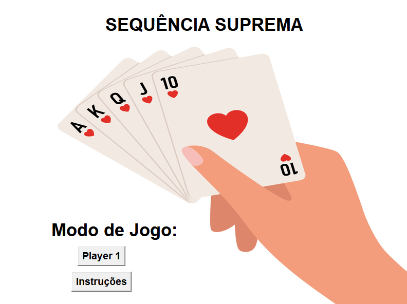
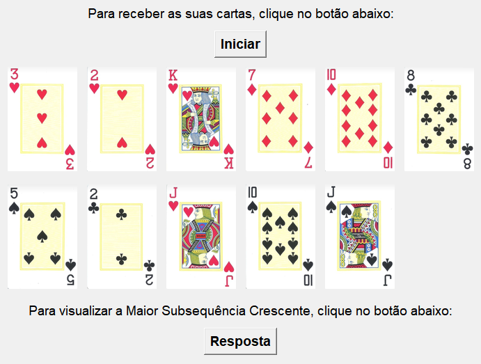
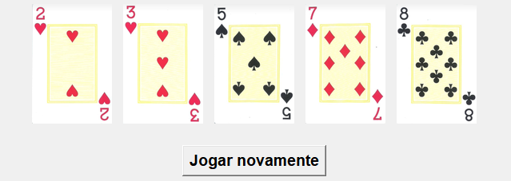

# Sequência Suprema

**Conteúdo da Disciplina**: Programação Dinâmica <br>

## Alunas
|Matrícula | Aluna |
| -- | -- |
| 20/0041606  |  Marina Márcia Costa de Souza |
| 20/0206040  |  Dara Maria Barbosa de Sousa  |

## Sobre 
O projeto consiste em uma interface gráfica e interativa que permite que o usuário escolha o modo "Player 1" e receba um conjunto de cartas. O usuário pode encontrar a maior subsequência crescente entre essas cartas utilizando o conceito de programação dinâmica. Além disso, o projeto oferece a opção de jogar novamente, reiniciando o jogo e recebendo um novo conjunto de cartas. O usuário também podem visualizar as instruções do jogo em uma janela separada.

## Screenshots
.
.
.
.

## Instalação  
**Linguagem**: Python 3.7.9 <br>
**Framework**: Tkinter

Uma vez que o python for instalado, execute o comando abaixo para instalar as dependências:

```cli
pip install tkinter 
````

Depois:

```cli
pip install Pillow
```

## Uso 
Para rodar o código, use o seguinte comando:

```cli
python main.py
```

## Outros 
- É crucial que o Python e o Pillow sejam intalados para realizar a execução do projeto;
- Se certifique de que os arquivos de imagem "png" estejam presentes no mesmo diretório do código ou forneça o caminho correto para o arquivo das imagens, caso contrário, podem ocorrer erros durante a tentativa de execução do jogo.
